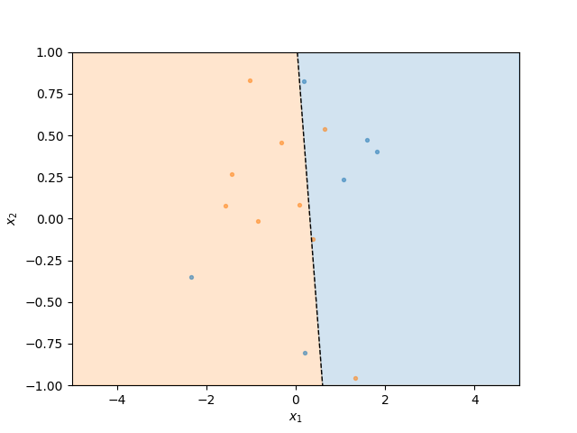

## Question 1

Palak Purohit - 18110110
<br />
Implementation: Vectorised version of gradient descent for logistic regression
<br />
------ON BREAST CANCER DATASET------
<br />
PARAMETERS:
<br />
fit_intercept = False
<br />
Starting value of theta: zeros
<br />
Number of iterations: 100<br />
LR = 3<br />
Batch size: len(X)<br />
```
----WITHOUT AUTOGRAD----
<br />
Total accuracy of the k-fold model (K=3) is 0.9365079365079364
<br /> Accuracies of 3 folds [0.8941798941798942, 0.9576719576719577, 0.9576719576719577]
<br />
----WITH AUTOGRAD----
<br />Total accuracy of the k-fold model is 0.9365079365079364
<br />Accuracies of 3 folds [0.8941798941798942, 0.9576719576719577, 0.9576719576719577]
<br />
```
PARAMETERS:<br />
fit_intercept = True<br />
Starting value of theta: zeros<br />
Number of iterations: 1000<br />
LR = 3<br />
Batch size: len(X)<br />
```
----WITHOUT AUTOGRAD----<br />
Total accuracy of the k-fold model is 0.9753086419753085
<br />
Accuracies of 3 folds [0.9629629629629629, 0.9841269841269841, 0.9788359788359788]<br />

----WITH AUTOGRAD----<br />
Total accuracy of the k-fold model is 0.9753086419753085<br />
Accuracies of 3 folds [0.9629629629629629, 0.9841269841269841, 0.9788359788359788]<br />
```
On increasing maximum iterations, the accuracy will increase if gradient has not reached its minima. <br />
On using fit intercept, accuracy is more since a constant term is also added to the coefficients, thus making it a better fit.<br />

Accuracy will also be affected on changing the starting value of theta for the same number of max iterations.
 
## Decision boundary for a random dataset
<p align = center>

</p>

