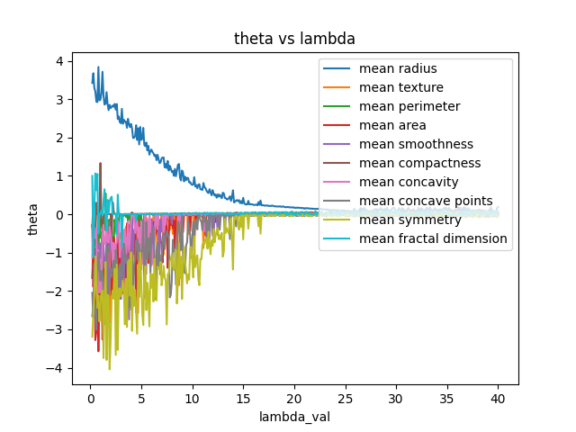

## Question 2

Palak Purohit - 18110110

## L1 Regularisation
Applying nested cross validation with 3 outer folds and 3 inner folds and varying lambda from 1 to 4 we get:

```
Optimal ld for all test-train folds is [4, 3, 2]
Maximum accuracy = 0.8862433862433862
```
Thus the optimal lambda is depending on the test-train split.

<br />

By plotting the value of thetas for different features vs lambda, we can see that the coefficients which get diminished for a larger value of lambda have higher importance. For example, the graph below has been plotted for 9 features out of which mean radius and mean symmetry seem to be the most important ones.

<p align = center>

</p>

## L2 Regularisation

Applying nested cross validation with 3 outer folds and 3 inner folds and varying lambda from 1 to 4 we get:

```
Optimal ld for all test-train folds is [2, 2, 2]
Maximum accuracy = 0.8783068783068783
```
Thus the optimal lambda is depending on the test-train split.
