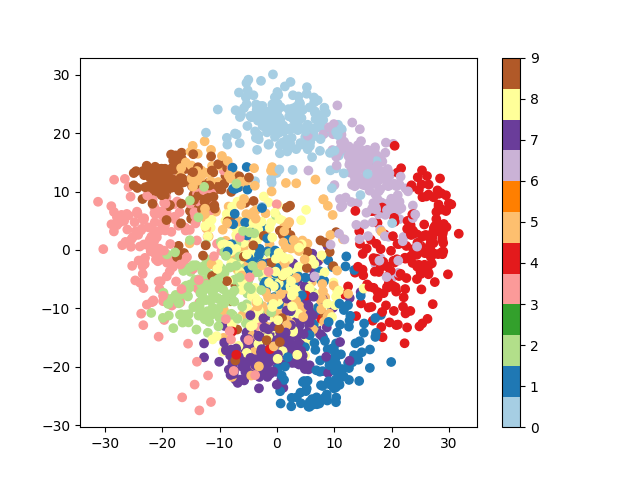
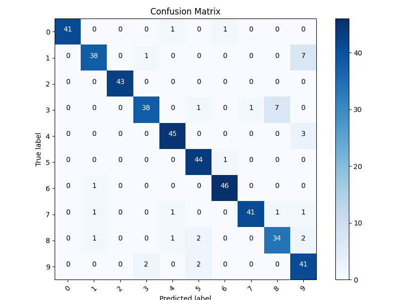

## K-class logistic regression

Implemented using softmax along with cross entropy loss using autograd.
Dataset: Digits dataset from sklearn
```
100%|███████████████████████████████████████████████████████████████████████████████████████████| 100/100 [00:02<00:00, 43.53it/s]
100%|███████████████████████████████████████████████████████████████████████████████████████████| 100/100 [00:02<00:00, 43.91it/s]
100%|███████████████████████████████████████████████████████████████████████████████████████████| 100/100 [00:02<00:00, 43.34it/s]
100%|███████████████████████████████████████████████████████████████████████████████████████████| 100/100 [00:02<00:00, 36.40it/s]
Total accuracy of the k-fold model is 0.9359688195991092
Accuracies of 3 folds [0.9487750556792873, 0.9153674832962138, 0.9643652561247216, 0.9153674832962138]
```
Using PCA, one can do dimensionality reduction and truncate the less important features. Then I have plotted a scatter plot for the dataset based on 2 features. 
Using this plot, one can make out that some of the digits seem easily linearly seperable while others are not. For example, from the scatter plot it is evident that digits 0 and 9 are linearly seperable on the basis of the 2 chosen features but 2 and 8 are not.

<p align = center>

</p>

Using the confusion matrix, one can visualise that 3 & 8 and 9 & 1 are the most confused digits since they are frequently missclasified as each other. Also, 0 seems to be the easiet one to identify. This can also be verified from the PCA plot.

<p align = center>

</p>