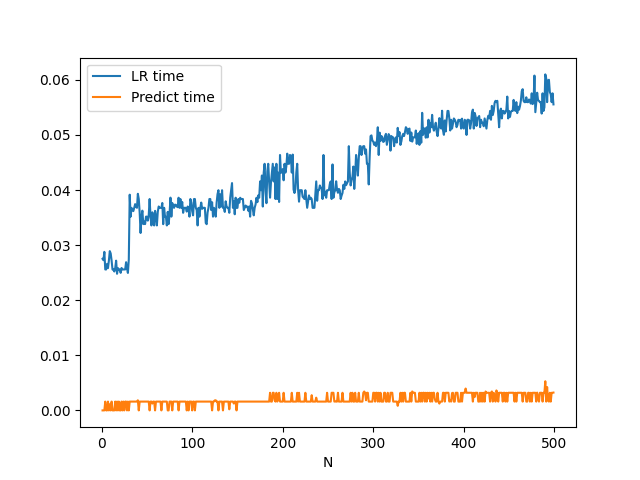
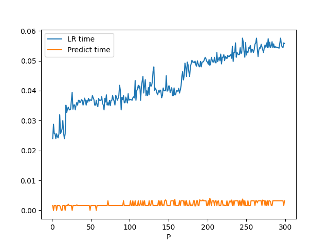
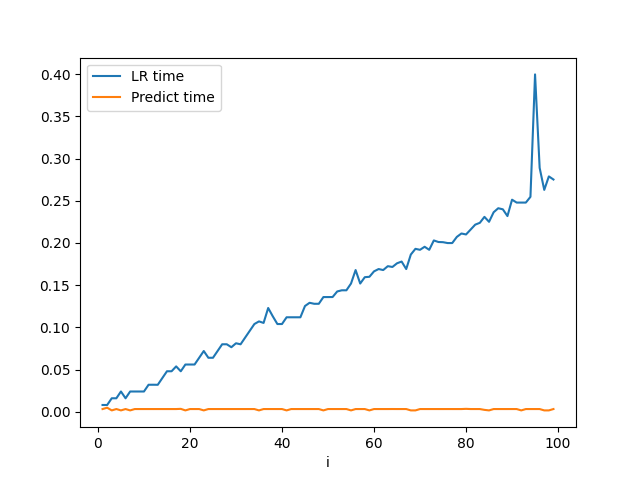

# ES654-2020 Assignment 3

*Palak Purohit* - *18110110*

In the below statements, N refers to the number of examples, P is the number of features, i is the iteration and 
> Time Complexity Analysis 
1. Training:
    - The time complexity for this is O(N * P * i * k) since it is the same as Gradient Descent in linear regression except that k-theta vectors are to be trained now for the k classes.

2. Predicting:
    - The time complexity for this is O(N * P * k) since we are essentially multiplying our X i.e NP with thetas which is P*k

> Space Complexity Analysis 
1. Training:
    - The space complexity of is O(N * P) (required to store X) + O(P * k) (required to store coefficients) and O(N * k) (required to store X*theta for calculating the loss) i.e O(N * P)+ O(P * k) + O(N * k)

2. Predicting:
    - The overall space complexity of this step is O(P * k) + O(N * P) for storing X and thetas.

Time vs N

Time vs P

Time vs i

